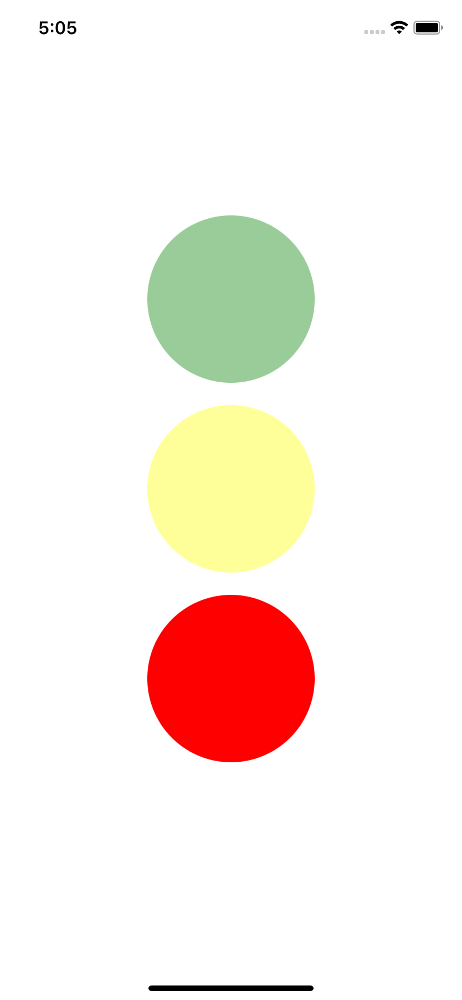
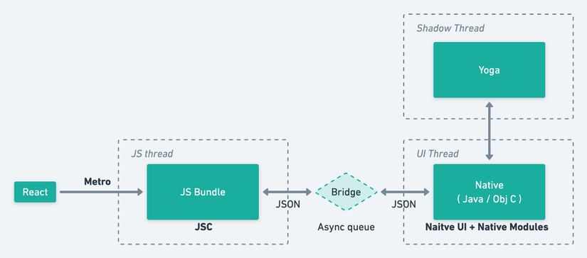

# TrafficLight

An basic example create Native Modules/Native UI Components and use them in React Native

## Quick start

- Installing dependencies: `yarn`

- Run app(Only iOS): `yarn ios`



## Architecture



- **Note:**: Above is old architecture, may it will update to new architecture. [Read more](https://itzone.com.vn/en/article/react-native-will-be-re-architecture-in-2020/)

## Light UI Component(ios folder)

- `LightView.swift`: Create Light View which is inherited from UIView

- `TrafficLight-Bridging-Header.h`: Created bridge communicate between Swift and Objective C code

- `Light.swift`: Subclass view controller LightView

- `Light.m`: Expose the functions of native to react javascript

## Import/Use Light UI(App.js)

```
    import {requireNativeComponent} from 'react-native';
    export const Light = requireNativeComponent('Light');
```